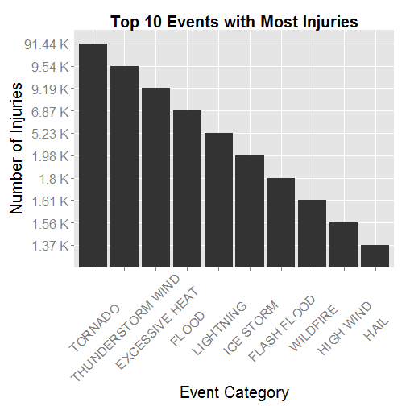
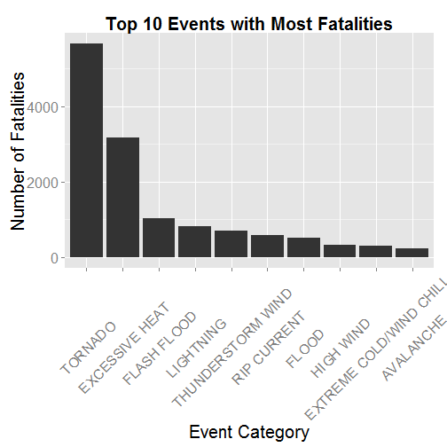
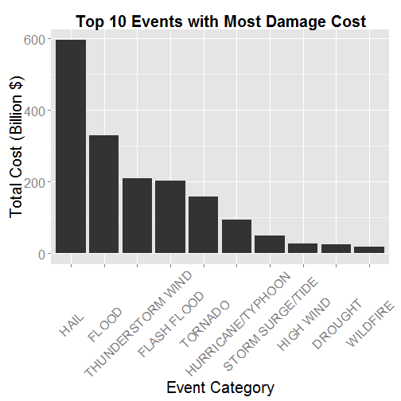

# Synopsis
Storms and other severe weather events can cause both public health and economic problems for communities and municipalities. Many severe events can result in fatalities, injuries, and property damage, and preventing such outcomes to the extent possible is a key concern.

This analysis involves exploring the U.S. National Oceanic and Atmospheric Administration's (NOAA) storm database. This database tracks characteristics of major storms and weather events in the United States, including when and where they occur, as well as estimates of any fatalities, injuries, and property damage.

Documentation can be found on the National Weather Service Storm website
[Documentation](https://d396qusza40orc.cloudfront.net/repdata%2Fpeer2_doc%2Fpd01016005curr.pdf)
as well as on the National Climatic Data Center Storm Events
[FAQ](https://d396qusza40orc.cloudfront.net/repdata%2Fpeer2_doc%2FNCDC%20Storm%20Events-FAQ%20Page.pdf)

The events in the database start in the year 1950 and end in November 2011. In the earlier years of the database there are generally fewer events recorded, most likely due to a lack of good records. More recent years should be considered more complete.

The data analysis will try to address the following questions:

1. Across the United States, which types of events are most harmful with respect to population health?
2. Across the United States, which types of events have the greatest economic consequences?

# Data Processing

#### 1. Load Required R Libraries

```r
library(lubridate)
library(dplyr)
library(ggplot2)
library(knitr)
```

#### 2. Set working directory (that is where all the R files and .Rmd file from 
#### this project should be)

```r
setwd("H:/Personal/Training/20150504 Coursera/Specialization in Data Science/05. Reproducible Research/Assessment/RepData_PeerAssessment2")
```

#### 3. Download and read storm data file

```r
fileurl <- "https://d396qusza40orc.cloudfront.net/repdata%2Fdata%2FStormData.csv.bz2"
filename <- "Stormdata.csv.bz2"
download.file(fileurl, filename)
stormdata <- read.csv(bzfile(filename), stringsAsFactors = FALSE, header = TRUE)
```

#### 4. Keep only columns necessary for the analysis

```r
data <- stormdata[,c("BGN_DATE", "EVTYPE", "PROPDMG", "PROPDMGEXP", "CROPDMG", "CROPDMGEXP", "INJURIES", "FATALITIES")]
```

#### 5. Examine the various multipliers to calculate real property (PROP) damage

```r
data %>%
    group_by(PROPDMGEXP) %>%
    summarise(no_rows = length(PROPDMGEXP))
```

```
## Source: local data frame [19 x 2]
## 
##    PROPDMGEXP no_rows
## 1              465934
## 2           +       5
## 3           -       1
## 4           0     216
## 5           1      25
## 6           2      13
## 7           3       4
## 8           4       4
## 9           5      28
## 10          6       4
## 11          7       5
## 12          8       1
## 13          ?       8
## 14          B      40
## 15          H       6
## 16          K  424665
## 17          M   11330
## 18          h       1
## 19          m       7
```

#### 6. Examine the various multipliers to calculate crop (CROP) damage

```r
data %>%
    group_by(CROPDMGEXP) %>%
    summarise(no_rows = length(CROPDMGEXP))
```

```
## Source: local data frame [9 x 2]
## 
##   CROPDMGEXP no_rows
## 1             618413
## 2          0      19
## 3          2       1
## 4          ?       7
## 5          B       9
## 6          K  281832
## 7          M    1994
## 8          k      21
## 9          m       1
```

#### 7. Create a new variable with year only

```r
data$year <- year(as.Date(data$BGN_DATE, "%m/%d/%Y"))
```

#### 8. Assign a multiplying factor based on PROPDMGEXP and CROPDMGEXP multipliers
Assume that wrongly coded values, i.e. "0", "1", "2", "3", 
"4", "5", "6", "7", "8", "?", "+", "-", "" represent a factor of 1


```r
data$PROPDMGFAC[toupper(data$PROPDMGEXP) == "H"] <- 100
data$PROPDMGFAC[toupper(data$PROPDMGEXP) == "K"] <- 1000
data$PROPDMGFAC[toupper(data$PROPDMGEXP) == "M"] <- 1000000
data$PROPDMGFAC[toupper(data$PROPDMGEXP) == "B"] <- 1000000000
data$PROPDMGFAC[data$PROPDMGEXP %in% c("0", "1", "2", "3", "4", "5", "6", "7", "8", "?", "+", "-", "")] <- 1
data$CROPDMGFAC[toupper(data$CROPDMGEXP) == "M"] <- 1000
data$CROPDMGFAC[toupper(data$CROPDMGEXP) == "K"] <- 1000000
data$CROPDMGFAC[toupper(data$CROPDMGEXP) == "B"] <- 1000000000
data$CROPDMGFAC[data$CROPDMGEXP %in% c("0", "2", "?", "")] <- 1
```

#### 9. Calculate the total cost of damage

```r
data$TOTALCOST <- (data$PROPDMG * data$PROPDMGFAC) + (data$CROPDMG * data$CROPDMGFAC)
```

#### 10. Keep only the observations which would have injuries, fatalities or damage cost

```r
impact <- data[which(data$INJURIES != 0 | data$FATALITIES != 0 | data$TOTALCOST != 0),]
```

#### 11. Use the function 'map_event' in source 'map_event.R'
This R file should be in your current working directory

This function will map all the event into one of the 48 main categories 
specified in the documentation.

Some events that could not be mapped have a CATEGORY = "UNKNOWN".
A column 'CATEGORY' is added to keep track of the main category of event


```r
source("mapevent.R")
impact$CATEGORY <- mapevent(as.character(impact$EVTYPE))
```

#### 12. Summarize the impact (injuries, fatalities, total cost of damage) for each event type

```r
summary <- impact %>%
    group_by(CATEGORY) %>%
    summarise(TOTALCOST = sum(TOTALCOST), 
              FATALITIES = sum(FATALITIES), 
              INJURIES = sum(INJURIES))
```

#### 13. Load function used to compress large numbers (used in results below)
This R file should be in your current working directory.

```r
source("comprss.R")
```

# Results

## 1. Events that are most harmful to population health

### Most Injuries
#### 1. a) Top 10 event categories (most injuries)

```r
most_injuries <- summary %>%
    select(CATEGORY, INJURIES) %>%
    arrange(desc(INJURIES)) %>%
    top_n(10)
```

#### 1. b) Sort to show event with most injuries on the left of the bar plot (desc)

```r
most_injuries$CATEGORY <- factor(most_injuries$CATEGORY, levels = most_injuries$CATEGORY[order(-most_injuries$INJURIES)])
```

#### 1. c) Display bar plot of event with most injuries

```r
g <- ggplot(most_injuries, aes(factor(CATEGORY), comprss(INJURIES))) +
    geom_bar(stat="identity") + 
    theme(
            text = element_text(size=20),
            axis.text.x = element_text(angle=45, vjust=0.5),
            plot.title = element_text(face="bold", size=20)
        )  +
    labs(title="Top 10 Events with Most Injuries",
        x="Event Category", y="Number of Injuries", color="Type")
print(g)
```

 
### Most fatalities
#### 2. a) Top 10 event categories (most fatalities)

```r
most_fatalities <- summary %>%
    select(CATEGORY, FATALITIES) %>%
    arrange(desc(FATALITIES)) %>%
    top_n(10)
```

#### 2. b) Sort to show event with most fatalities on the left of the bar plot (desc)

```r
most_fatalities$CATEGORY <- factor(most_fatalities$CATEGORY, levels = most_fatalities$CATEGORY[order(-most_fatalities$FATALITIES)])
```

#### 2. c) Display bar plot of event with most fatalities

```r
g <- ggplot(most_fatalities, aes(factor(CATEGORY), FATALITIES)) +
    geom_bar(stat="identity") + 
    theme(
        text = element_text(size=20),
        axis.text.x = element_text(angle=45, vjust=0.5),
        plot.title = element_text(face="bold", size=20)
    )  +
    labs(title="Top 10 Events with Most Fatalities",
         x="Event Category", y="Number of Fatalities", color="Type")
print(g)
```

 
## Events with the greatest economic consequences
### Most crop and property damage
#### 1. a) Top 10 event categories (most damage cost to property and crop)

```r
most_damage_cost <- summary %>%
    select(CATEGORY, TOTALCOST) %>%
    arrange(desc(TOTALCOST)) %>%
    top_n(10)
```

#### 1. b) Sort to show event with most damage cost on the left of the bar plot (desc)

```r
most_damage_cost$CATEGORY <- factor(most_damage_cost$CATEGORY, levels = most_damage_cost$CATEGORY[order(-most_damage_cost$TOTALCOST)])
```

#### 1. c) Display bar plot of event with most damage cost

```r
g <- ggplot(most_damage_cost, aes(factor(CATEGORY), TOTALCOST/10^9)) +
    geom_bar(stat="identity") + 
    theme(
        text = element_text(size=20),
        axis.text.x = element_text(angle=45, vjust=0.5),
        plot.title = element_text(face="bold", size=20)
    )  +
    labs(title="Top 10 Events with Most Damage Cost",
         x="Event Category", y="Total Cost (Billion $)", color="Type")
print(g)
```

 
